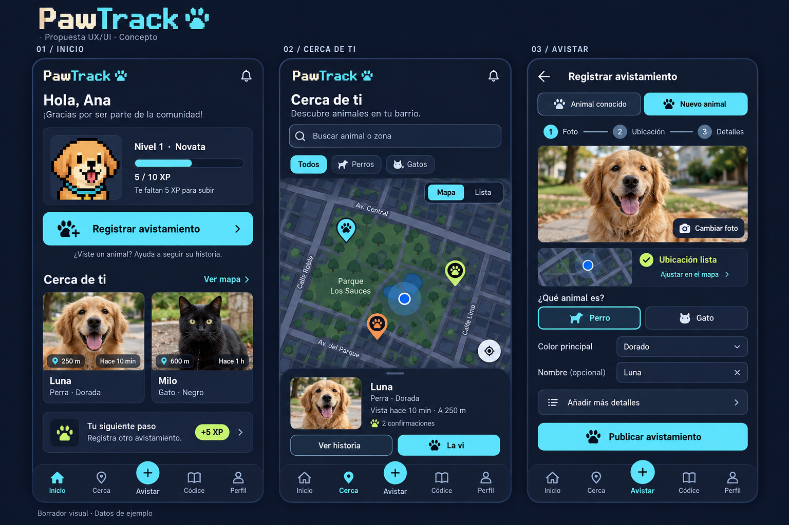

# PawTrack UX/UI review

October 4, 2026 · Proposal only

## Recommended direction

Keep the pixel-art pets, nighttime palette, and discovery/progression theme.
Make the surrounding interface quieter and easier to read: readable body text,
larger animal photography, clearer actions, and a map centered on a useful area.
PawTrack can retain its game personality while becoming easier to use outdoors,
with one hand, and during a brief animal encounter.

This review is based on the current React screens and captured mobile views.
Findings are design observations, not results from user interviews or a measured
accessibility audit. No application code or live UI was changed for this proposal.

## Prioritized recommendations

| Priority | Current observation | Proposed change | Expected benefit |
|---|---|---|---|
| First | Small pixel lettering is used for metadata, labels, and navigation as well as branding. | Reserve pixel type for the logo and short headings. Use a readable sans-serif for body copy, forms, timestamps, and navigation. Start with 16px body text and avoid compressed line heights. | Easier scanning and fewer reading errors on phones. |
| First | Cyan/magenta outlines, ornaments, glow, and dense card borders compete for attention. | Use a small set of card surfaces, subdued borders, consistent spacing, and one primary action color. Keep pixel corners and mascots as recognizable accents. | A clearer visual hierarchy without losing the theme. |
| First | Home repeats destinations already in bottom navigation; “Mapa” and “Animales” both lead to the same page. | Make home a useful summary: compact level card, a prominent “Registrar avistamiento” button, nearby/recent animals, and one next achievement. Use one combined exploration destination. | Less menu browsing; quicker access to the core task. |
| First | “Nuevo” creates a new animal directly, while sightings of an existing animal use a different flow. | Make “Avistar” open an explicit choice: “Animal conocido” or “Nuevo animal”. Offer nearby possible matches before creating a new record, with “No es ninguno” to continue. | Makes the difference understandable and may reduce duplicate animal records. |
| First | Raw coordinates are prominent; fitting every animal can zoom the map out across countries. | Show a local viewport after location permission, a recenter control, species filters, and a map/list toggle. When location is unavailable, retain manual map positioning. Make numeric coordinates an advanced fallback. | Helps users find relevant animals and correct locations without geographic jargon. |
| First | Animal rows emphasize counts and coordinates; photos are small and some sample photo URLs are unusable. | Show a larger thumbnail, animal name/species, last-seen time, and distance when available. Use a clear fallback illustration for unavailable photos. | Makes animals easier to recognize and compare. |
| Next | Photo, location, and details form one long capture form with limited recovery guidance. | Group the form into three clear sections: photo, location, details. Keep optional fields collapsed, show upload status, retain entered data after recoverable errors, and keep the primary button within easy reach. | Less uncertainty during capture and fewer abandoned submissions. |
| Next | Reporting and confirmation can be confused; a confirmation is attached to a specific historical sighting. | Use distinct labels: “La vi” for a new sighting and “Confirmar este avistamiento” within a dated history entry. Explain that a confirmation corroborates that entry. | Better data quality and clearer expectations. |
| Next | XP, Patitas, breed discoveries, and levels compete without much explanation. | Keep the puppy avatar consistent across home/profile, label the XP bar, explain how to earn the next level, and give Patitas a short explanation. Surface one achievable next step rather than many counters. | Makes progression feel understandable and connected to contribution. |
| Next | Breed discovery currently depends on text matching while the form asks primarily for color. | Add an optional explicit breed selection with “Mestizo” and “No sé”. Keep color separate and avoid presenting inferred breed as verified fact. | Aligns the collection experience with what people actually enter. |
| Later | Settings exposes API/environment details and offers language choices without full translations. | Put diagnostics behind an “Ayuda y diagnóstico” section. Offer only supported languages until translation covers screens, errors, dates, and accessibility labels. | Makes settings more relevant and avoids misleading controls. |

## Visual and interaction specifications

- **Color:** midnight navy background, lighter navy cards, cream text, cyan for
  primary actions/selection, lime for success and progress. These proposed colors
  still need measured contrast checks in implementation.
- **Type:** readable body text and sentence-case labels; pixel lettering limited
  to brand moments. Give names and multi-line Spanish text room to wrap.
- **Touch:** aim for 44–48 CSS pixel control heights as a product design target.
  WCAG 2.2 AA's minimum target-size criterion is 24×24 CSS pixels, with exceptions;
  the larger product target is intentional, not a claim about the AA requirement.
  [W3C target-size guidance](https://www.w3.org/WAI/WCAG22/Understanding/target-size-minimum.html)
- **Contrast:** verify normal text at 4.5:1 and large text at 3:1; check disabled,
  secondary, error, and selected states separately. Do not communicate status with
  color alone. [W3C contrast guidance](https://www.w3.org/WAI/WCAG22/Understanding/contrast-minimum.html)
- **Feedback:** use specific states such as “Buscando ubicación”, “Subiendo foto”,
  “Foto lista”, and “Avistamiento publicado”. Keep a retry path and preserve input.
- **Navigation:** stable bottom labels, obvious active state, keyboard focus,
  screen-reader labels, and safe-area spacing. Show notification indicators only
  when there is actual unread activity.
- **Location:** ask for permission in context, explain why it helps, and label
  distance as approximate. Distances refer to last reported locations, not live
  animal tracking. Area names require an additional place lookup or manual choice.

## Visual draft

The image demonstrates three proposed screens: **Inicio**, **Cerca de ti**, and
**Avistar**. It preserves the golden pixel puppy and night palette while making
the content larger and the actions clearer. Names, animal photos, map locations,
distances, and account progress are illustrative sample content.

This is an AI-generated design concept, not an implemented screen or a final
interaction specification. In implementation, the three capture sections should
use consistent progress/completion states, and “Perro/Gato” should not imply that
the app stores animal sex. Real screen dimensions, scrolling, keyboard behavior,
text wrapping, contrast, and touch targets require validation in the browser.

Generated with the built-in image generation tool. The exact prompt is saved in
`image-prompt.txt`.

## Suggested rollout and validation

1. **Readability first:** typography, spacing, quieter decoration, photo fallbacks,
   and navigation labels. Mostly frontend presentation changes.
2. **Core task flow:** unified sighting entry, photo/location feedback, map pin
   adjustment, and local discovery. Requires interaction and location-state work.
3. **Progression clarity:** explain XP/Patitas and make breed selection explicit.
   Explicit breed storage requires an API/database change and a migration plan;
   it is more than a visual adjustment.

Before committing to the redesign, ask beta testers to find a nearby animal,
report an existing animal without creating a duplicate, correct an inaccurate
location, and recover from a failed upload. Observe completion, confusion,
mis-taps, duplicate records, and time to submit. Compare against the current app;
no improvement percentages are assumed here.
